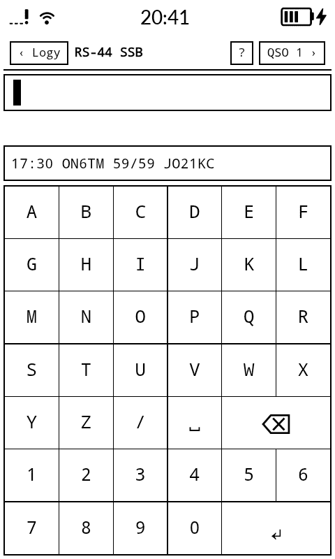
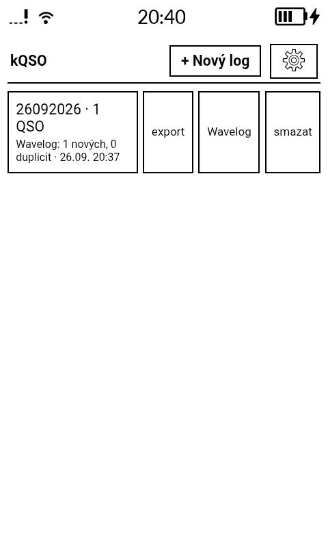
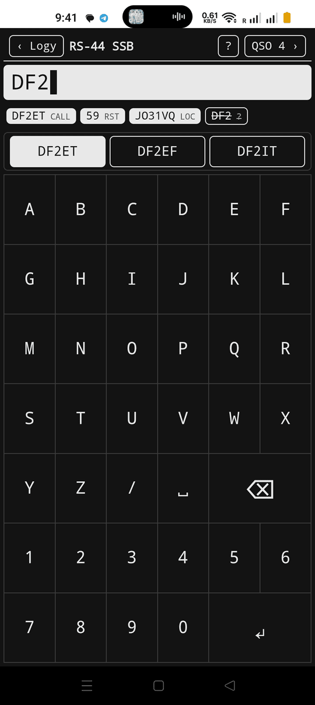
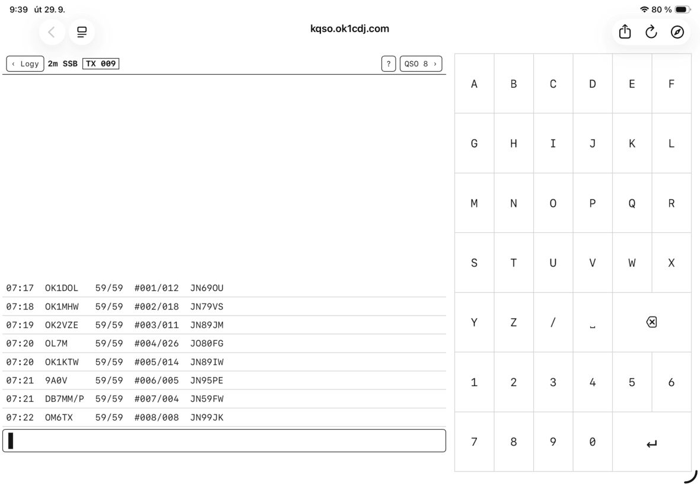
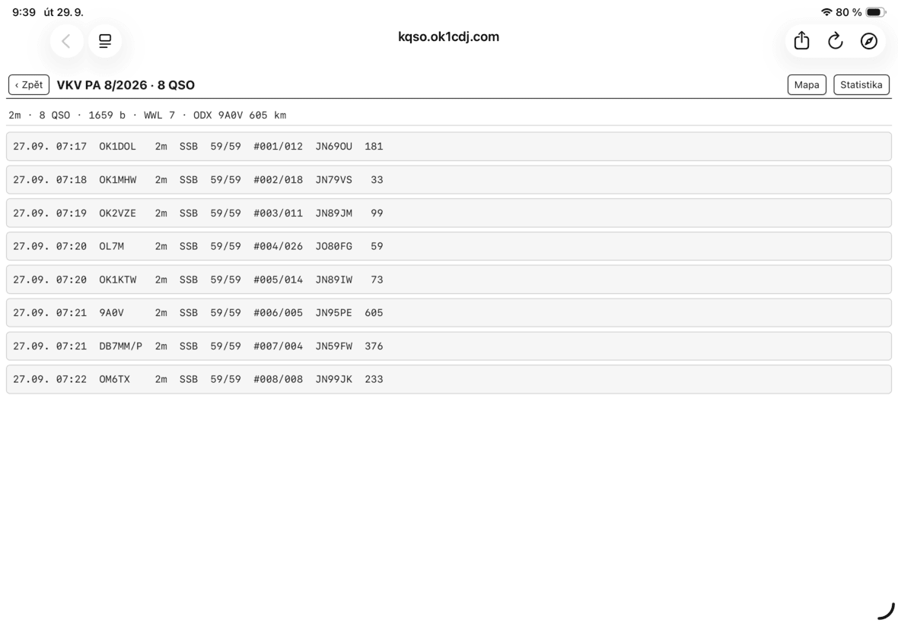
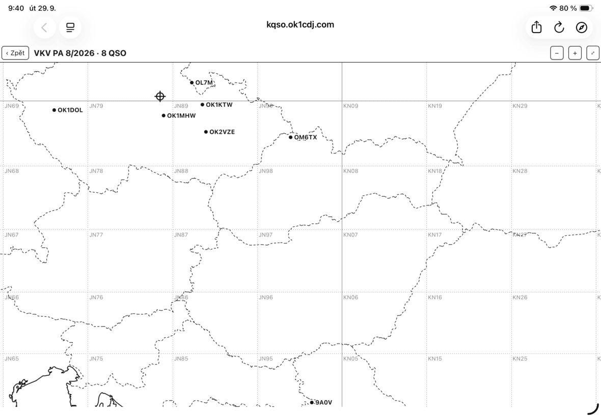

# kQSO

A ham radio logger with a single, smart input line. One line recognizes what you
type — callsign, band/mode, report, serial, locator, award reference — so you can
log a QSO with almost no taps. It runs as a web app (offline PWA) and as an
Android APK (the same web app in a WebView shell).

Target devices (all first-class): **Mudita Kompakt** (480×800 e-ink), iPad/tablet,
desktop.

- **Live web:** <https://kqso.ok1cdj.com/> (web 1.4.0; the old `ok1cdj.github.io/kQSO/` redirects there)
- **APK:** [GitHub Releases](https://github.com/ok1cdj/kQSO/releases) (1.4)

[](https://www.buymeacoffee.com/ok1cdj)

## Screenshots

<p>
  
  
  
</p>

Mudita Kompakt (e-ink, APK) · Android phone (dark mode, suggestions + parse preview)



iPad, VHF contest: logging with the keyboard beside the recent QSOs



QSO list: points per QSO, score line per band (QSO · points · WWL · ODX)



QSO map: worked stations over the Maidenhead grid, your QTH as the crosshair

## Features

- **One input line, own 6×7 alphabetical keyboard** (no system keyboard; a hardware
  keyboard works too). A parse preview under the line shows what will be saved.
- **Bands** 160m…70cm and microwaves up to 76 GHz: 23cm 13cm 9cm 6cm 3cm 1.25cm
  6mm 4mm (ADIF names; EDI `PBand` 1,3…76 GHz). Microwaves can be typed in GHz —
  `1G 2G 3G 5G 10G 24G 47G 76G` — handy for `24G`, since the keyboard has no dot.
- **Log profiles**, chosen when a log is created:
  - **Activation** (SOTA / POTA / WWFF) — your reference is set when the log is
    created; the worked station's reference is logged for S2S.
  - **General** — adds the name.
  - **VHF contest** — serials, 6-char locator required, IARU R1 scoring (below).
  - **Satellite** — one log per pass; the bird (RS-44, SO-50, ISS, QO-100…) is
    picked at creation and sets uplink/downlink band and `SAT_NAME`.
- **Callsign database:** suggestions and locator prefill from a bundled set per
  profile (VHF contest / chasers / satellites) plus your own worked stations, kept
  apart from the logs; export / import (merge) / delete in Settings.
- **DUPE warning:** same call + band + mode; VHF contest same call + band (any
  mode); satellite same call + bird. It only warns, never blocks.
- **Line commands:** `W` discards the unfinished QSO, `D` deletes the last saved one.
- **VHF contest scoring:** 1 point per km between locator centres (111.2 km/°,
  truncated + 1), each station once per band. QRB shows in the preview; the QSO
  list has points per QSO and a score line per band (QSO · points · WWL · ODX).
- **QSO map** (VHF contest, satellite): a dot per worked locator with the call, the
  Maidenhead grid and your QTH over bundled Natural Earth coastlines and borders
  (1:10m Europe, 1:50m world) — works offline; calls can be switched off.
- **Contest statistics:** per band points, average per QSO and the band's top 10.
- **Export:** ADIF per log (all bands); VHF contest also **EDI (REG1TEST), one file
  per band** — contest name/section asked at export, station fields remembered.
- **Wavelog push:** General, Satellite and VHF-contest logs can be sent to your own
  Wavelog (API v2, Wavelog 3.1+) with one tap in the log list — never automatically;
  duplicates are skipped by Wavelog, so resending is safe. Set up URL + a `wl2_`
  token (scopes `qso:write`, `station:read`) in Settings; no server CORS setup needed.
- **Storage that survives:** every QSO is appended to the log file at once; an
  unfinished QSO is kept in a crash journal and offered back after a restart.
  Web: OPFS (persistent storage requested); APK: `.adi` files in app storage.
- **E-ink / standard display modes** (the APK starts in e-ink), keep-screen-on while
  logging, EN / CS UI (by the system language).

- **Anonymous usage statistics (web only):** screen views and a few action names
  (log created with its profile, ADIF/EDI export, Wavelog push) go to a self-hosted
  Umami (`stats.ok1cdj.com`) by a plain `fetch` — no tracker script, no cookies,
  never any log content (no calls, locators, QSOs). Off in the APK and in dev;
  switchable in Settings; dropped when offline.

Out of scope: ADIF import (the flow is log → export → forget).

## How to log

Type a whole QSO on one line; press Enter to fold parts into the QSO, Enter on an
empty line to save it. Only the callsign is required.

```
40m ssb                    band + mode (sticky until changed)
24G cw                     microwaves in GHz (→ 1.25cm), also 10G, 76G…
OK1ABC                     callsign → saves with defaults
OK2XYZ OK/ZC/001           worked station + SOTA reference (→ OK/ZC-001)
DL5ABC 55 JO60UN           received report + locator
G8AHK/P PETR               name (General profile)
1832 OK1ABC                HHMM first = manual UTC time
OK1ABC ⏎ JN79US ⏎ ⏎        fill piece by piece, empty Enter saves
W                          (alone) discard the unfinished QSO
D                          (alone) delete the last saved QSO, after a confirm
```

The received report is a bare number, the sent report is `T57`; both default per
mode (59 on SSB/FM, 599 on CW). In the VHF-contest profile a bare number is the
serial (`58123` = report 58 + serial 123):

```
2m ssb
OK1ABC 007 JO60UN          serial + locator → preview shows QRB (points)
```

On a satellite log the exchange is report + locator (`9A5Y 59 JN86`); typed band
tokens are ignored. See **Settings → How to log** in the app for the full grammar.

## Development

TypeScript + Vite + Vitest, **no runtime dependencies** (static bundle, no CDN).

```bash
cd web
npm ci
npm test          # the whole core: parser, ADIF, EDI, scoring, calldb, Wavelog… (Vitest)
npm run typecheck # 4 projects: core / browser / worker / sw
npm run dev       # dev server at /
npm run build     # production build to web/dist (base /)
```

Layout:

```
web/
├── src/core/       parser, model, ADIF, EDI, scoring, calldb — pure logic, no DOM
├── src/db/         bundled callsign sets (vkv / sat / awards TSV)
├── src/platform/   the ONLY storage access (web: OPFS worker; APK: KQSONative bridge)
├── src/theme/      design tokens for e-ink / standard display modes
├── src/ui/         screens, keyboard, i18n (en/cs)
├── src/sw.ts       service worker (offline-first, web only)
└── tests/          Vitest
app/                Android WebView shell (Kotlin, AGP 9, minSdk 30, compileSdk 37)
```

### Android shell

`app/` (`com.ok1cdj.kqso`) serves the bundled web build locally through
`WebViewAssetLoader`. The `KQSONative` bridge gives native storage (logs as `.adi`
files), SAF export, the system file picker (callsign DB import) and keep-screen-on;
`INTERNET` is only for the Wavelog push. Local build needs JDK 17+ with `javac`
(e.g. Android Studio's JBR) and an Android SDK via `sdk.dir` in `local.properties`:

```bash
cd web && npm run build       # web bundle → copied into app assets at build time
cd ..
export JAVA_HOME=/opt/android-studio/jbr
./gradlew :app:assembleRelease  # signed when local.properties has the signing.* keys
./gradlew :app:assembleDebug    # debug build (different signature → uninstall first)
```

## Deploy & release

- **Web:** push to `main` → GitHub Actions (`deploy.yml`: `npm ci`, typecheck, test,
  build) → `web/dist` deployed to GitHub Pages, custom domain `kqso.ok1cdj.com`
  (DNS: `CNAME kqso → ok1cdj.github.io`). The build uses base `/`.
- **APK:** bump `versionCode` / `versionName` in `app/build.gradle.kts`, then push a
  `v*` tag (`git tag v1.4 && git push origin v1.4`) → `release.yml` builds the web,
  signs the release APK and attaches it to a GitHub Release as
  `kqso-<versionName>.apk`. It can also be run by hand (`workflow_dispatch`) —
  that only uploads the APK as a build artifact.

Signing needs **repository secrets** (Settings → Secrets and variables → Actions),
like the rest of the app family:

| secret | value |
|---|---|
| `KEYSTORE_BASE64` | `base64 -w0 keystore/kqso.jks` |
| `KEYSTORE_PASSWORD` | keystore password |
| `KEY_ALIAS` | key alias (`kqso`) |
| `KEY_PASSWORD` | key password |

The keystore (`keystore/kqso.jks`, gitignored, backup outside the repo) was created
once with the command below — **keep it stable** across releases (otherwise updates
fail on a signature mismatch). Locally the same values go into `local.properties`
as `signing.storeFile`, `signing.storePassword`, `signing.keyAlias`,
`signing.keyPassword`.

```bash
keytool -genkeypair -v -keystore keystore/kqso.jks -alias kqso \
  -keyalg RSA -keysize 4096 -validity 10000
```

## License

GPL-3.0
